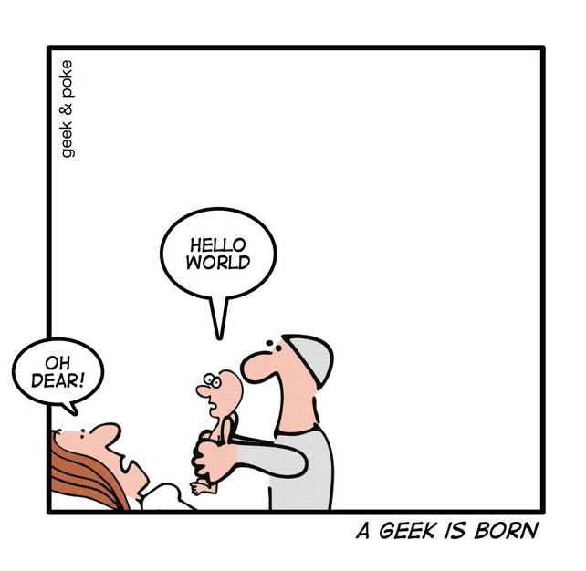

# Hallo, Wêreld!

The first elf language is the sharing of emotions.
Next comes their mother tongue.
When elves start speaking their first programming language, then they are already onto their third language!

Santa imagines `raku` draws inspiration from many principles of [Unix philosophy](https://en.wikipedia.org/wiki/Unix_philosophy) (wikipedia.org).
In particular, localization of `raku` plays into the [robustness principle](https://en.wikipedia.org/wiki/Robustness_principle) (wikipedia.org).

When writing to Santa, it doesn't matter which language you write your wishlist in -- for Santa is learning all the languages he can:

~~~~raku
say 'Hello, World!' # English, or
sê 'Hallo, Wêreld!' # Afrikaans
~~~~

It is kinder thought Santa — especially to those writing their first list — to get their feet wet by writing in a language closer to their heart.

# TLDR

~~~~raku
use L10N::AF;

# Trim whitespace (leading and trailing)
sit .sny vir '/pad/na/lêer'.IO.lyne

# List lines containing specified text
.sit as .bevat: 'soekteks' vir '/pad/na/lêer'.IO.lyne
~~~~

# Install

To speak with the alf elf, the summoning charm is via `zef`:

~~~~bash
$ zef install L10N::AF
~~~~

To write your wishlist in Afrikaans, don't forget to include `use L10N::AF` near the top of your list.
Or use the prepaid postage envelopes labelled `afrku` or `lekker`:

~~~~bash
$ lekker -e 'sê "Hallo, Wêreld!"'
Hallo, Wêreld!
~~~~

# Other languages

The talkative elves have discovered that between them they already speak [eleven languages](https://github.com/Raku-L10N/) (github.com).
To find an elf that speaks your language, replace `XX` in `use L10N::XX` with the elf's nickname:

| Language   | ISO 639 Set 1 |
| ---------- | ------------- |
| Afrikaans  | AF            |
| Dutch      | NL            |
| Esperanto  | EO            |
| French     | FR            |
| German     | DE            |
| Hungarian  | HU            |
| Italian    | IT            |
| Japanese   | JA            |
| Portuguese | PT            |
| Chinese    | ZH            |
| Welsh      | CY            |

# PRESERVATION OF HUFFMANIZATION

Santa doesn't much like chimneys as they are too long.
Why huff and puff when he can send his smaller elves down, like `sê`, `so`, `vra` and `met`:

~~~~raku
use L10N::AF;

#| Pangram test / Toets vir 'n pangram
sub is-pangram ($sin = vra 'Sin: ') {
    sê so .kl.bevat: alle 'a'..'z' met $sin
}

is-pangram q :tot /GEDIG/;
    Bask with grammars,
    Coax via allomorphs,
    Sequences of huffmanized joy.
GEDIG
# True
~~~~

# DECORATIONS

Festive elves sprinkled decorations on some of the presents, like `sê` (`say`) and `reël` (`rule`).
This did not slow Santa as the first four things he swallowed from the explosion at his ASCII factory were U, T, F and 8.
Diacritics are also fun to input when you configure your keyboard to use a [compose key](https://en.wikipedia.org/wiki/Compose_key) (wikipedia.org).
The keystroke sequences often form a visual composition then, for example:

| Character | Keystrokes            |
| --------- | --------------------- |
| ê`        | `Compose` + `e` + `^` |
| ë         | `Compose` + `e` + `"` |

# DUAL TRANSLATIONS

Some elves couldn't make up their minds what they wanted for Xmas.
Santa has allowed them to wrap their own gifts twice which has made them happy again for now:

| Afrikaans        | English  |
| ---------------- | -------- |
| basisnaam        | basename |
| aanpas-lêermodus | chmod    |
| aanpas-lêerskap  | chown    |
| gids             | dir      |
| gidsnaam         | dirname  |
| sif              | grep     |
| kop              | head     |
| koppel           | link     |
| maak-gids        | mkdir    |
| drukf            | printf   |
| skrap-gids       | rmdir    |
| slaap            | sleep    |
| sorteer          | sort     |
| stert            | tail     |
| ontkoppel        | unlink   |

( Words in common shell usage have been kept as alternate translations -- either can be used. )

# ARRAYS

Some elves [need help remembering](https://stackoverflow.com/questions/19107752/javascript-shift-unshift-mnemonics) (stackoverflow.com) which end of the sleigh they are servicing and whether they are loading or unloading:

Santa decided to label both ends of the sleigh and split the elves into fore and aft teams:

| English        | Afrikaans              |
| -------------- | ---------------------- |
| pop, push      | trek-einde, druk-einde |
| shift, unshift | trek-begin, druk-begin |

# COMPOSABLE

Raku and Afrikaans share a composable aspect.
Santa's elves giggle when making associations between concepts:

| Afrikaans                              | English                                 |
| -------------------------------------- | --------------------------------------- |
| Waar, Onwaar                           | True, False                             |
| skrap, skrap-nl, skrap-gids            | delete, chomp, rmdir                    |
| maak-oop, maak-toe, maak, maak-gids    | open, close, make, mkdir                |
| gee, teruggee, opgee, gegewe, vergewe* | return, returns, fail, given, forgiven* |
| afrond, afrondaf, afrondop             | round, floor, ceiling                   |
| stop, stopsein                         | die, fatal                              |

* [Slang::Forgiven](https://raku.land/zef:witawayar/Slang::Forgiven) (raku.land) by Mustafa Aydın merges `for` and `given` into `forgiven`.
Santa [wonders how](https://github.com/mustafaaydn/Slang-Forgiven/issues/1) (github.com) to localize this new gift.

# SENSITIVITY

Abuse by coercive control is not yet addressed by the [Inclusive Naming Initiative](https://inclusivenaming.org/about/) (inclusivenaming.org).
It is [recognized in law](https://en.wikipedia.org/wiki/Controlling_behavior_in_relationships) (wikipedia.org) in England and Wales (2015) and Ireland (2019).
Santa is peaceable and so with his awareness of escalatory metaphors and imprecise terminology of the non-elves, he has tried to find translations that are more descriptive, less disproportionate and better suited to a programming language.

In programming context, the word "coerce" is used to change a value between types.
Here Santa chose `herskep` (recreate) rather than "dwang" (coerce).
This ties in with the root term `skep` (create) and with `omskep` (map/convert).
Santa wondered if his de-escalations mattered:

| English | Afrikaans | English re-translation |
| ------- | --------- | ---------------------- |
| CONTROL | BESTUUR   | manage                 |
| die     | stop      | halt                   |
| fatal   | stopsein  | stop signal            |
| snitch  | aanskou   | to witness             |

But was rather happy to express himself.
